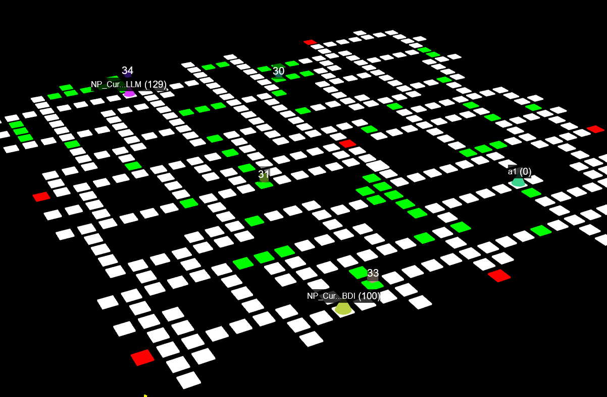

# NPCurious



A coordinated multi-agent system for the [Deliveroo.js](https://github.com/unitn-ASA/Deliveroo.js) parcel delivery game, built for the **Autonomous Software Agents** course at the University of Trento (A.Y. 2025-26).

## Overview

Agent A is a BDI agent that navigates, collects, and delivers parcels autonomously. Agent B is an LLM-powered agent that interprets natural-language missions from the game chat and solves them through an iterative tool-calling loop. The LLM agent can coordinate the team by executing actions by itself or delegating to Agent A over the game socket.

## Prerequisites

- [Node.js](https://nodejs.org/) (v18+)
- [pnpm](https://pnpm.io/) or npm

## Setup

```bash
git clone https://github.com/skiiyuru/NPCurious

cd NPCurious

pnpm install

```

Set `HOST`, `TOKEN` (Agent A), `TOKEN_B` (Agent B), and `LLM_BASE_URL` in `.env`.

## Usage

```bash
pnpm start:a    # Agent A (BDI agent)
pnpm start:b    # Agent B (LLM agent)
```
